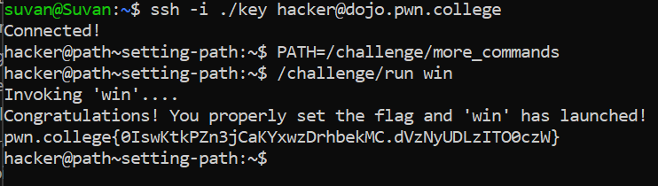

# Setting Path

## Basic Understanding

`PATH` stores a list of directories to find commands in. Using PATH we can add a new directory of programs to our commands list.

By adding directories to or replacing directories in this list, you can expose these programs to be launched using their bare name.

## Challenge Objective

The objectice of this challenge is to run a custom command by it's barename by  adding it to the PATH environment variable.

## Challenge Goals

In this challenge, `/challenge/run` will run the win command via its bare name, but this command exists in the `/challenge/more_commands/` directory, which is not initially in the PATH. The win command is the only thing that `/challenge/run` needs, so you can just overwrite PATH with that one directory.

So I  will use the following command to add the directory to the PATH:

**Command** - `PATH= /challenge/more_commands

Then I ran the the  command `/challenge/run` invoking it with  the bare name `win`.

**Command** - `/challenge/run win`

From this, I got the flag

## Flag

**pwn.college{0IswKtkPZn3jCaKYxwzDrhbekMC.dVzNyUDLzITO0czW}**

