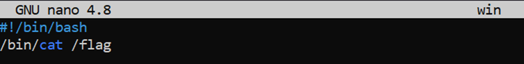
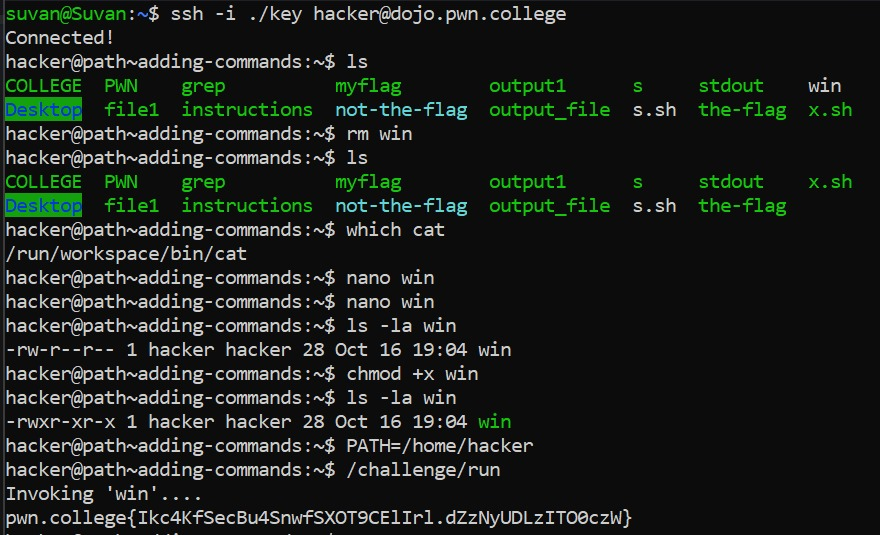

# Adding commands

## Challenge Goals

This time, `win` does not exist! Recall the final level of Chaining Commands, and make a `shell script` called `win`, add its location to the PATH, and enable `/challenge/run` to find it.

`Hint` : /challenge/run runs as root and will call win. Thus, win can simply cat the flag file. Again, the win command is the only thing that /challenge/run needs, so you can just overwrite PATH with that one directory. But remember, if you do that, your win command won't be able to find cat.

Okay so we need to make a  `win` command by making  a shell script, add its location to the PATH, and then make `/challenge/run` find it.

So the first thing I did is to find where the `cat` command is located. For this, I used the `which` command.

**Command** - `which cat`

I found that the  `cat` command is located in `/bin/cat`.

`bin` which stands for binary is a  directory that includes basic binaries for the that are required for the basic  functionality of the system. It is usually located in the root directory of the system.

The next thing I did was make the `win` shell script. For this I opened the `nano` text editor.

I  then added the following lines to the script:

```
#!/bin/bash
/bin/cat /flag
```

`#!/bin/bash` in shell script is called **shabang** & its use is to tell the system which interpreter/command to use to execute a command.

Then I included the path for the `cat` command. So when I basically executed the `win` command,  it will execute the `cat` command which will print the flag as we have given the path of `cat`.




Then I used the `ls` command with the flag `-la` which stands for "long all" for the `win` command. This basically  lists all the files and directories in the current directory along with their permissions, ownership, and timestamps.

**Command** - `ls -la win`

I saw that the win did not have any **executable(x)** permissions.

Hence I used the `chmod` command with the argument  `+x` to add the executable permissions to the `win` command.

**Command** - `chmod +x  win`

After making  the `win` command executable, I again used the `ls` command with the flag `-la` to confirm my changes.


Now the final, task was to put the path of the `win` command into the PATH variable.

To find the path of the win command, I used the following command:

**Command** - `find ~ -name "win"`

From this, I found out that  the `win` command was located in the `/home/hacker` directory.

Finally after giving the `PATH` variable the path `"/home/hacker"`, I ran the  `/challenge/run` program and got the flag.



## Flag

**pwn.college{Ikc4KfSecBu4SnwfSXOT9CE1Irl.dZzNytDLzITOGczW}**

