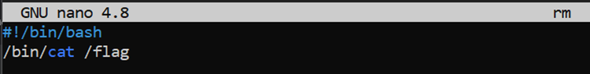
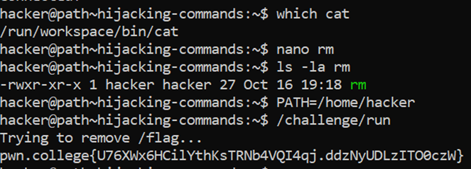

# Hijacking Commands

## Challenge Goals

This challenge will delete the flag using the `rm command`. But unlike before, it will not print anything out for you.

So the approach of this level is similar to the previous level. We basically want to prevent the default `rm` command from deleting and instead make it try to print the flag.

So I thought of making a shell script called `rm` but it will contain the path of `cat` to basically  print the flag instead of deleting it.

So I found cat's path using the which command.

**Command** - `which cat`

Then I opened the nano text editor to create my shell script `rm`.

Then I put the following lines in my nano script which will basically try to cat the flag when the rm command is executed.

Then I used `ls -la`  to check if the script is executable or not. If it is not executable.  I used the `chmod +x` command to make it executable.

Then I found the path of rm script from the following command - 

**Command** - `find ~ -name "rm"`

Then I changed my path variable to /home/hacker which is the path of rm script and ran the /challenge/run program on it.

From this, I got my flag.

## Flag

**pwn.college{U76XWx6HC11YthKsTRNb4VqI4qj.ddzNyUDLz1TO0czW}**
