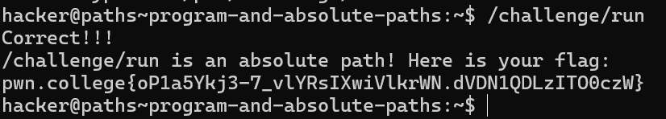

# Program and Absolute Paths

## Basic Terminologies

**Absolute Path**- Starts at the root directory, represented by the forward slash (/), and provides the complete path to a file or directory.

**Relative Path**-  Starts from the current working directory, and provides the path to a file or directory relative to the current directory.

## Challenge Objective

The objective of this challenge is to obtain the flag by following a longer absolute path.

## Challenge Goals

Challenges in pwn.college are in challenge directory and the challenge directory is right in the root directory(/).

After logging into pwn.college server, I need to execute the run file that is  located in the challenge directory which is in turn located in the  root directory(/).

**Command** *(directory path)*: /challenge/run

From this I succesfully obtained the flag.

## Flag

**pwn.college{oP1a5Ykj3-7_vlYRsIXwiVlkrWN.dVDN1QDLzITO0czW}**

