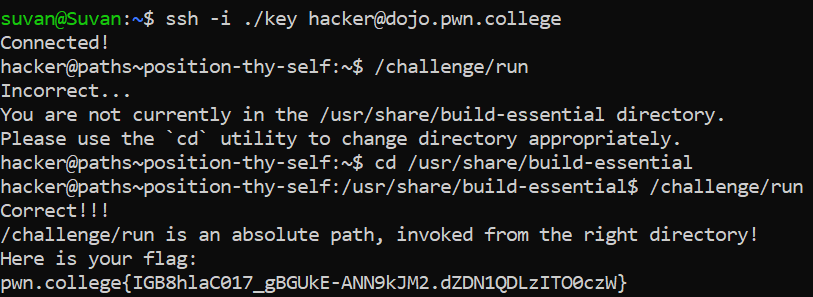
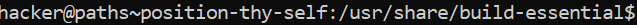

# Position Thy Self

## Challenge Objectives
The objective of this challenge is to familiarise one with the "cd"  command, which is used to change the current working directory.

cd - change directory

## Challenge Goal

This challenge requires us to execute the **/challenge/run** program from a specific path by navigating using the **cd** command.

After I used logged in to the pwn.college server, I executed the "/challenge/run" program.

**Command**- /challenge/run

However, this was incorrect as the  program was not in the correct directory.The program was in the /usr/share/build-essential directory instead. Hence, I changed my directory to the required directory using the cd command.

**Command** - cd  /usr/share/build-essential 

Now we see our directory has changed as the ~$ symbol has been replace by "/usr/share/build-essential$".

Now we can execute the "/challenge/run" program as we are now in the correct directory.

**Command** - /challenge/run

And hence, we obtain our flag.

## Flag

**pwn.college{IGB8hlaC017_gBGUkE-ANN9kJM2.dZDN1QDLzITO0czW}**
