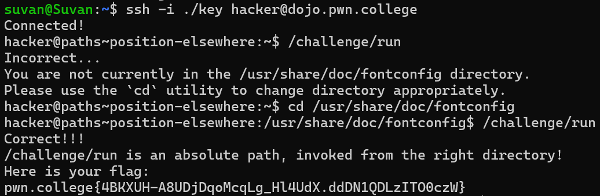

# Position Elsewhere

## Challenge Objectives
The objective of this challenge is to familiarise one with the "cd"  command, which is used to change the current working directory.

## Challenge Goal

Just like the previous challenge this challenge requires us to execute the **/challenge/run** program from a another path by navigating using the **cd** command.

After I used logged in to the pwn.college server, I executed the "/challenge/run" program.

**Command**- /challenge/run

However, this was incorrect as the  program was not in the correct directory.The program was in the /usr/share/fontconfig directory instead. 

Hence, to changed my directory to the required directory,I used the  **cd** command.

**Command**- cd /usr/share/doc/fontconfig

Now we see our directory has changed as the ~$ symbol has been replace by "/usr/share/fontconfig".

Now we can execute the **/challenge/run** program as we are now in the right directory.

**Command**- /challenge/run

After entering this command, we obtain  the flag.

## Flag

**pwn.college{4BKXUH-A8UDjDqoMcqLg_Hl4UdX.ddDN1QDLzITO0czW}**

