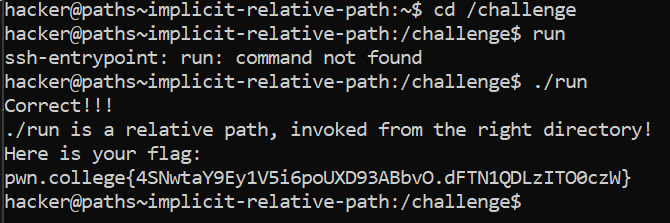

# Implicit Relative Path

## Challenge Objectives

The objective of this challenge is to help us understand how Linux handles program execution with respect to relative paths.

In Linux, when we try to execute a program with a name that doesn't include a path (a 'naked' path), it doesn't automatically look in the current directory for security reasons. This challenge requires us to explicitly specify the current directory using ./ to run a program located there.

## Challenge Goals

This challenge requires us to run the program from the **/challenge** directory.

We know that we need to run the program from /challenge directory.Therefore, I used the cd command to change my directory.

**Command**- cd /challenge

Now if I try to execute the "run" path without declaring it explicitly, it throws an error.

This is actually a safety measure: if Linux searched the current directory for programs every time you entered a naked path, you could accidentally execute programs in your current directory that happened to have the same names as core system utilities.

Therefore, to launch "run" in this scenario we need to explicitly declare it.

**Command**- ./run

After executing this command, we successfully obtain the flag.
## Flag

**pwn.college{4SNwtaY9Ey1V5i6poUXD93ABbvO.dFTN1QDLzITO0czW}**