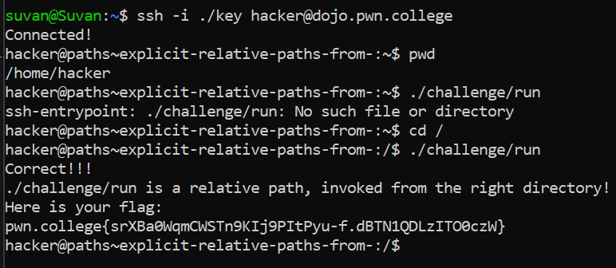

# Explicit Relative Paths

## Basic Understanding

"." refers to the current directory.

".." refers to the parent directory which is the directory immediately above the current directory.

## Challenge Objectives

Previously, our relative path was "naked": it directly specified the directory to descend into from the current directory. In this level, we explore more explicit relative paths.

The objective of this level is to make us understand how to explicitly use the "." in our relative paths

## Challenge Goals

We need to execute the **/challenge/run** program by explicitly  using the "." in our relative path.

After I logged in to pwn.college server, I used the "pwd" command to see which directory I currently was in.

**Command**-pwd

After running the command,I saw that I saw currently in /home/hacker directory.

I explicitly called the relative path ./challenge/run to  execute the program.However, this did not work has there is no path from  the **"/home/hacker"** to the challenge directory.

Instead the relative path was from the root directory **"/"**.

Hence, I used the cd command to change my directory  to the root directory.

**Command**- cd /

Now I again ran the path **./challenge/run** and this time I successfully obtained the flag.

**Command**- ./challenge/run

## Flag

**pwn.college{srXBa0WqmCWSTn9KIj9PItPyu-f.dBTN1QDLzITO0czW}**

