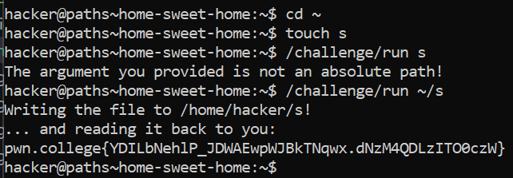

# Home Sweet Home

## Challenge Objectives

Every user has a home directory, typically under /home in the filesystem. In the dojo, you are the hacker user, and your home directory is **/home/hacker**.

 **~** - shorthand for /home/hacker.

 The objective of this challenge is to make one familiar with "~".

 ## Challenge Goals

 The goal of the 'Home Sweet Home' challenge is to use the **/challenge/run** command to write a copy of the flag to a file within our home directory. Here are the constraints we need to consider:

1. The path you specify must be an absolute path.
2. The path must be inside your home directory.
3. Before expansion, your argument must be three characters or less.

We also need to use "~" to meet these requirements

We know that we need to create a file  in the home directory,to keep a copy of the flag.

For this we use the **"touch"** command.

**touch**-  creates a new empty file.

Here I am creating a new empty file called "s" in my home directory using the "touch" command.

**Command**- touch s

