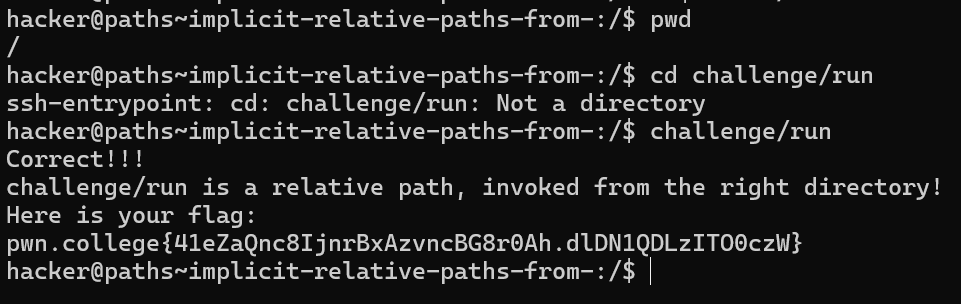

# Implicit Relative Paths

## Basic Understanding

If we put in absolute paths everywhere, it doesn't matter which directory we are in.

However , if we use relative paths, it matters which directory we are in.

- A relative path is any path that does not start at root (i.e., it does not start with /).
- A relative path is interpreted relative to your Current Working Directory (cwd).
- Your cwd is the directory that your prompt is currently located at.

This means that where we locate a specific file depends on the  directory we are in.

## Challenge Objectives

The objective of this challenge is to make one understand how  relative paths work in Linux and how to access a file from a give relative path.

## Challenge Goals

We'll need to **/challenge/run** program using a relative path with a cwd of "/". We are also given that the relative path starts with the letter "c".

I used the **pwd** (present working directory) command to check my present working directory which is "/" in this case.

**Command**- pwd

From the way all the previous levels have  been structured, we can infer that the relative path is "challenge/run".

I made a mistake here by using the "cd" command. Here we are simply  trying to access a file using a relative path, not changing the directory. So, we don't need to use the cd command.

Now we know that relative paths do not need to begin with a "/". 
Hence instead of my execution command being "/challenge/run" it is simply **"challenge/run"**.

**Command**- challenge/run

After doing this, we successfully obtain our flag.

## Flag
**pwn.college{41eZaQnc8IjnrBxAzvncBG8r0Ah.dlDN1QDLzITO0czW}**

