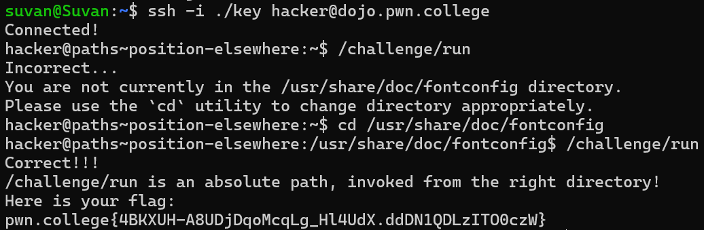

# Position Yet Elsewhere

## Challenge Objectives
The objective of this challenge is to familiarise one with the "cd"  command, which is used to change the current working directory.

## Challenge Goals

Just like the previous challenge this challenge requires us to execute the **/challenge/run** program from a another path by navigating using the **cd** command.

After logging in to the pwn.college server, I executed the "/challenge/run" program.

**Command**- /challenge/run

However, this was incorrect as the  program was not in the correct directory.This time the program was in the /var/log directory instead.

To change the directory, I  used the **cd** command.

**Command**- cd /var/log

Now we see our directory has changed as the ~$ symbol has been replace by "/var/log

Now we can execute the **/challenge/run** program as we are now in the right directory.

**Command**-  /challenge/run

From this, we obtain the flag

## Flag

**pwn.college{s3s1V0q2I2yjM66tCnvaWcD3C0q.dhDN1QDLzITO0czW}**

