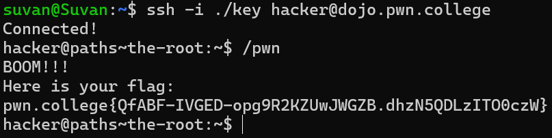

# The Root

## Challenge Objective
The Linux filesystem is a tree. This tree has a  root node, which is the topmost node in the tree. The root node is represented by the  forward slash `/` character.

Every  file and directory in the Linux filesystem is a node in this tree. Each node has a unique path which always starts from the root "/".

## Challenge Goals
In this level, we need to access the program in the "pwn" directory and we can then obtain the flag.

After I connected to the pwn college server, I invoked a program by specifying the path. The path starts from the root "/"  and ends with the "pwn" directory.

**Command** - /pwn

From this, I successfully obtained the flag.

## Flag

**pwn.college{QfABF-IVGED-opg9R2KZUwJWGZB.dhzN5QDLzITO0czW}**
