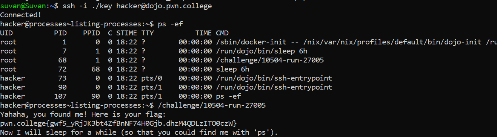

# Listing Processes

## Basic Understanding

`ps command` -  Used  to display information about running processes.

## Challenge Objectives

The objective  is to use the "ps" command to list all the processes running on the system.

## Challenge Goals

In this challenge, `/challenge/run` is renamed to a random filename, and this time made it so that you cannot "ls" the /challenge directory.

In this I used the `ps -ef`  command, the `-e` option is used to list all processes, and the `-f` option.

**Command** - `ps -ef`

From this, I saw that there is a program called **/challenge/10504-run-27005**  running, which is the renamed **/challenge/run** file.

**Command** - `/challenge/10504-run-27005`

## Flag

**pwn.college{gwf5_yRjJK3bt4ZfBnNF74H0Gjb.dhzM4QDLzITO0czW}**

