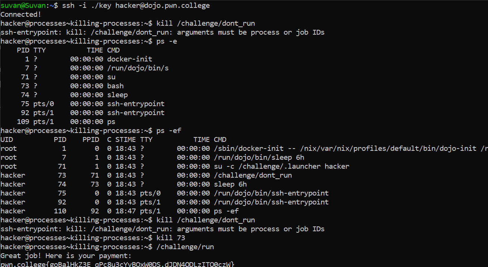

# Killing Processes

## Basic Understading

`kill command` - Used  to terminate a process.

## Challenge Objectives

The objective  of this challenge is to terminate a process with a specific process ID.

## Challenge Goals

In this challenge, `/challenge/run` will refuse to run while `/challenge/dont_run` is running! We must find the dont_run process and kill it.

The first mistake I made  was trying to use the "kill" command without  specifying the process ID.

So to get the process IDs,  I used the **"ps"** command with the **"-ef"** flag.

**Command'** - `ps -ef`

Then I found that  the process ID of the `/challenge/dont_run` process is **73**.

Then I killed the don't run process by using the following command.

**Command** - `kill 73`

Then I ran the  `/challenge/run` command and I got the flag.

## Flag

**pwn.college{goBalHkZ3E_qPc8u3cYyBOxW0DS.dJDN4QDLzITO0czW}**

