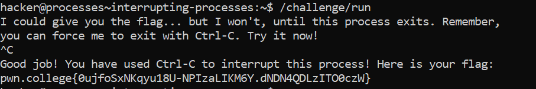

# Interrupting Processes

## Basic Understanding

`Ctrl-C` - sends an "interrupt" to whatever application is waiting on input from the terminal and, typically, this causes the application to cleanly exit.

## Challenge Objective

The objective of this challenge is to teach the user how to interrupt a process running in the Linux CLI.

## Challenge Goals

In this challenge, `/challenge/run` will refuse to give the flag until you interrupt it.

I first ran the  command `/challenge/run` and in the next prompt I used  `Ctrl-C` to interrupt the process. 

From this I got the flag.

## Flag

**pwn.college{0ujfoSxNKqyu18U-NPIzaLIKM6Y.dNDN4QDLzITO0czW}**