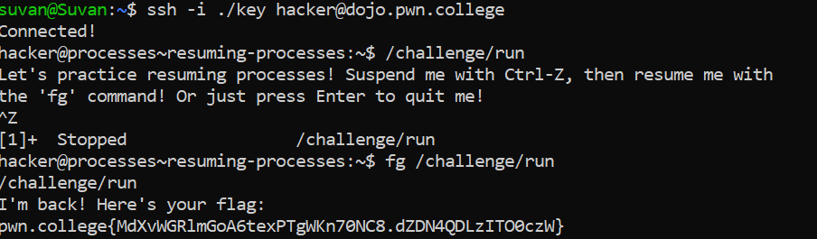

# Resuming Processes

## Basic Understading

`fg command` - Used to resume a process

## Challenge Objectives

The objective of this challenge is to teach the user how to resume a suspended process.

## Challenge Goals

 This challenge's run needs us to suspend it, then resume it.

 

 I first ran the `/challenge/run` program and used `Ctrl-Z` to suspend it.

 Then I used the `fg` command to resume the suspended "/challenge/run" program.

 **Command** - `fg /challenge/run`

 From this, I got the flag.

 ## Flag

 **pwn.college{MdXvWGRlmGoA6texPTgWKn70NC8.dZDN4QDLzITO0czW}**

 