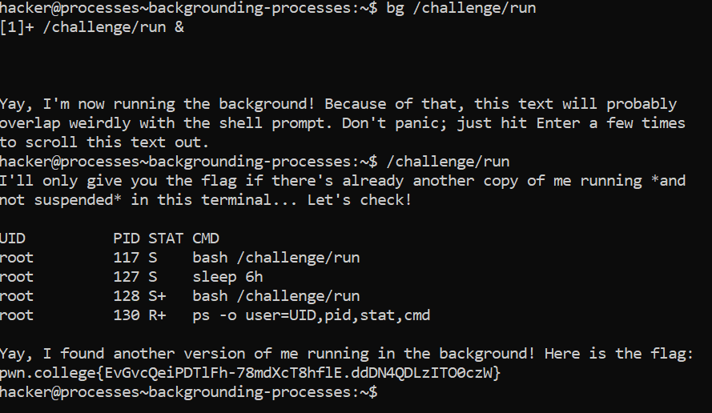

# Backgrounding Processes

## Basic Understanding

`bg command` - Used to resume a process in the background.

## Challenge Objectives

The objective of this challenge is to use the "bg" command to resume a suspended in the background.

## Challenge Goals

In this level, we must run the `/challenge/run` by first suspending it, then running it in the background and then running another `/challenge/run` program.

I first executed to **/challenge/run** program and then used **Ctrl-Z** to suspend the program.

Then I used the `bg` command to run the suspended program in the background.

**Command** - `bg /challenge/run`

Then I again ran the /challenge/run program and got the flag.

## Flag

**pwn.college{EvGvcQeiPDTlFh-78mdXcT8hflE.ddDN4QDLzITO0czW}**