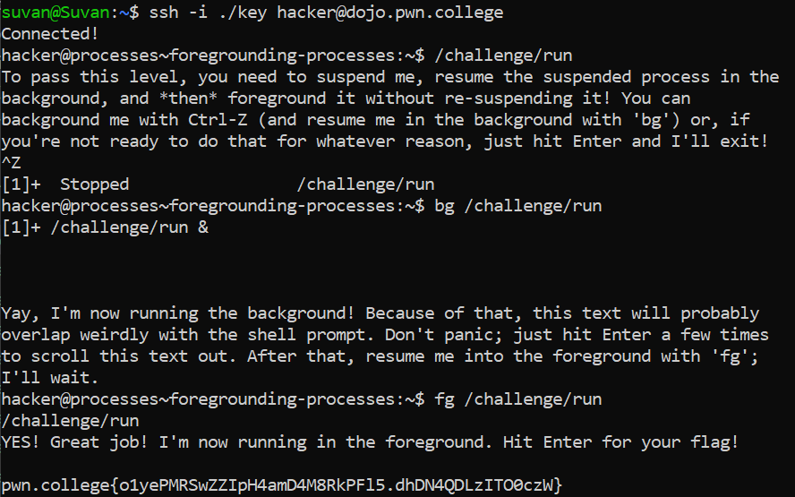

# Foregrounding Processes

## Challenge Objectives

The  objective of this challenge is to foreground processes that are already backgrounded.

## Challenge Goals

Okay so I first executed the `/challenge/run` and used `Ctrl-Z` to suspend the process.

Then I used the `bg` command to run the suspended program in the background.

Then I used the `fg` command to foreground the previously backgrounded command.

From this, I got the flag.

## Flag

**pwn.college{o1yePMRSwZZIpH4amD4M8RkPFl5.dhDN4QDLzITO0czW}**