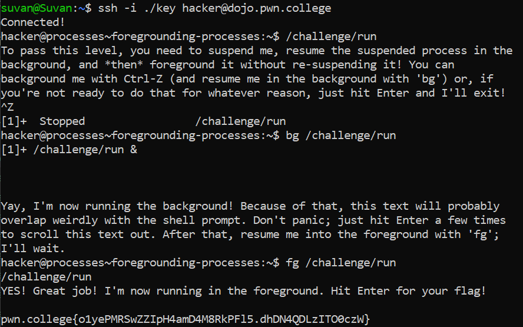

# Starting Background Processes

## Basic Understanding

`& suffix` - Used to background a process give as prefix

## Challenge Goals

In this challenge, we must background `/challenge/run` without suspending it.

I used the /challenge/run with the suffix "&" to  background the process.

**Command** - `/challenge/run &`

From this, I got the flag.

## Flag

**pwn.college{4hp-suPFOAyoCnZIq8boLMyNo8F.dlDN4QDLzITO0czW}**
