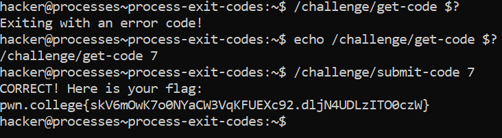

# Process Exit Codes

## Basic Understanding

Every shell command, including every program and every builtin, exits with an exit code when it finishes running and terminates.

We can access this exit code by using the `$?`  variable in bash. 

In most cases, If `exit code = 0` -  the command was successful.

If `exit code = 1` - the command was unsuccessful

## Challenge Objective 

The objective of this challenge is to obtain the 
exit code of a command.

## Challenge Goals

In this challenge, we must retrieve the exit code returned by `/challenge/get-code` and then run /`challenge/submit-code` with that `error code as an argument.`

So I used ran the `/challenge/get-code` program and appended the variable `$?` to it to get the error code.However, I missed adding the **echo** first because of which I couldn't get the error code value printed.

**Command** - `echo /challenge/get-code $?`

From this I got the error code = **7**.

Then I ran the **/challenge/submit-code** program with the error code "7" as argument.

**Command** - `/challenge/submit-code 7`

From  this I got the flag.

## Flag

