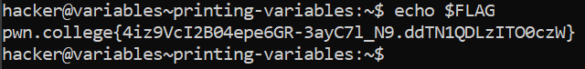

# Printing Variables

## Basic Understanding

The Linux command line interface is actually a sophisticated programming language. The Linux CLI is also known as the "Shell". Programs written on the shell are known as `"shell scripts"`.

Just like any other programming language, the shell also supports  variables.

`echo`-  The `echo` command is used to print stuff.

`echo  $variable_name` - This will print the value of the variable.

## Challenge Objectives

The objective of this challenge is to introduce variables in Linux to the user and teach them how to print variables

## Challenge Goals

In this challenge, we need to print the value stored inside the **"FLAG"**  variable.

To print the value stored inside the "Flag" variable, I used the **"echo"** with the argument **"$FLAG"** to access the variable "FLAG" and print its value.

**Command**-  `echo $FLAG`

From this I got the flag.

## Flag

**pwn.college{4iz9VcI2B04epe6GR-3ayC7l_N9.ddTN1QDLzITO0czW}**