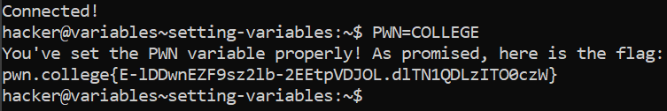

# Setting Variables

## Basic Understanding

Just like printing the values of variables, we can also set the values  of variables using the assignment operator `=`.

variable_name=variable_value

There shouldn't be any space between  the variable name and the assignment operator. Also the variable names are case-sensitive.

## Challenge Objectives

The objective of this challenge is to teach the user how to properly set the value of variables.

## Challenge Goals

To solve this level, we must set the `PWN variable` to the `value COLLEGE`.

So to set the value  of **PWN** variable to value **COLLEGE**, I used the following command:

**Command** - `PWN=COLLEGE`

From this I obtained the flag.

## Flag

**pwn.college{E-lDDwnEZF9sz2lb-2EEtpVDJOL.dlTN1QDLzITO0czW}**

