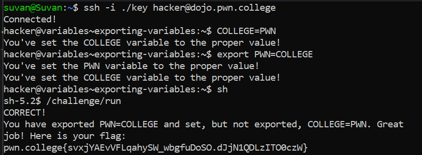

# Exporting Variables

## Basic Understanding

By default, variables that we set in a shell session are local to that shell process. That is, other commands we run won't inherit them.

To make our variables explicitly  available to other commands, we can export them. This is done using the `export` command.

When we export your variables, they are passed into the environment variables of `child processes`.

## Challenge Objectives

The objective of this challenge is to learn how to export variables in the Linux CLI.

## Challenge Goals

In this challenge, we must invoke `/challenge/run` with the `PWN` variable exported and set to the value `COLLEGE`, and the `COLLEGE` variable set to the value `PWN` but **not exported**.

In followed the step given below to get the flag:

 **Step 1** -  Set the `COLLEGE` variable to `PWN` and export it.

 **Command** - `COLLEGE=PWN`

 **Step 2** - Set the `PWN` variable to `COLLEGE` and export it.

 **Command** - `export PWN=COLLEGE`

 **Step 3** - We invoke the child of the main shell `sh`.

 **Step 4** - Now in the "sh" shell we run /`challenge/run` program.

 From this, I obtained my flag successfully.

 ## Flag

 **pwn.college{svxjYAEvVFLqahySW_wbgfuDoSO.dJjN1QDLzITO0czW}**

