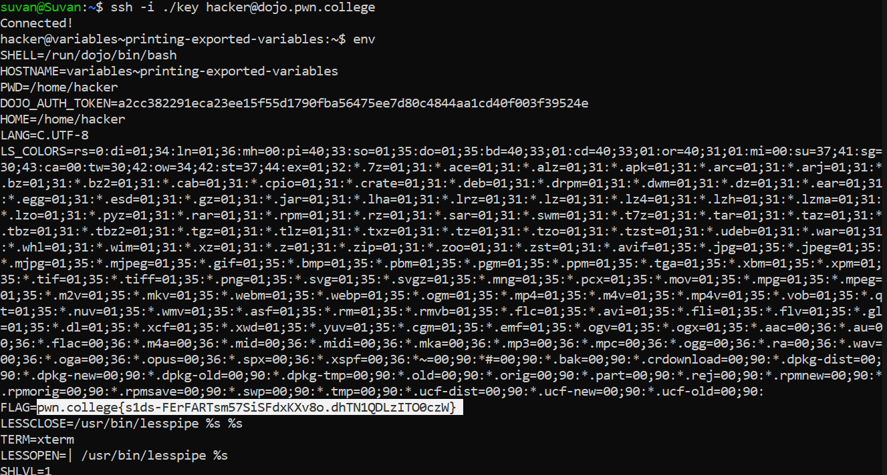

# Printing Exported Variables

## Basic Terminologies

`env command` - prints out all the exported  variables in the current shell session.

## Challenge Objectives

The objective of this challenge is to teach the user how to  print out all the exported variables in the current shell session using the `env command`.

## Challenge Goals

In this challenge, we need to use the **env** command and look for the flag in its output.

I used the `env` command  to print out all the exported variables in the current shell session. 

After looking through the output, I found the flag.

## Flag

**pwn.college{s1ds-FErFARTsm57SiSFdxKXv8o.dhTN1QDLzITO0czW}**

