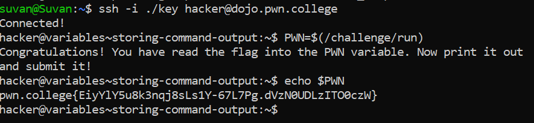

# Storing Command Output

## Basic Understanding

`Command Substitution` - When we store the output of some command to a variable.

## Challenge Objectives

The objective of this challenge is to teach the user `Command Substitution`  and how to store the output of a command to a variable.

## Challenge Goals

In this challenge, we must read the output of the `/challenge/run` command directly into a variable called `PWN`, and it will contain the flag.

I stored the output of **"/challenge/run"** into the **"PWN"** variable using the following command:

**Command** - `PWN=$(/challenge/run)`

## Flag

**pwn.college{EiyYlY5u8k3nqj8sLs1Y-67L7Pg.dVzN0UDLzITO0czW}**

