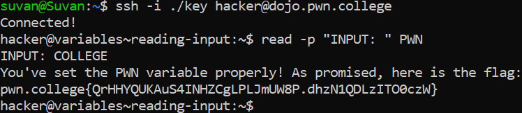

# Reading Inputs

## Basic Understanding

`read` - Used to read input from the user

`read -p` -  Used to read input from the user with a prompt.

## Challenge Objectives 

The objective of this challenge is to teach the user how to use the `read` command to take input from the command prompt.

## Challenge Goals

In this challenge, we need to use "read" to set the `PWN variable` to the `value COLLEGE`.

I used the **read -p** command to take the  input from the user and set the **PWN** variable to the value **COLLEGE**.

**Command** - `read -p  "INPUT: " PWN`

**Prompt** - `INPUT : COLLEGE`

## Flag

**pwn.college{QrHHYQUKAuS4INHZCgLPLJmUW8P.dhzN1QDLzITO0czW}**

