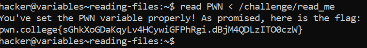

# Reading Files

## Basic Understanding

Previously, we have read user input into a variable. You've also previously redirected files into command input! Put them together, and you can read files with the shell.

I feel like this concept can be better understood with an example.

Example - echo "test" > some_file
  
          read VAR < some_file
 
          echo $VAR
 
          test

The example redirects some_file into the standard input of read, and so when read reads into VAR, it reads from the file

## Challenge Goals

In this challenge, we must read  `/challenge/read_me` into the `PWN` environment variable to get the flag.

I used the  following  command to redirect  the `/challenge/read_me` file into the read command of the `PWN` variable.

**Command** - `read PWN < /challenge/read_me`

