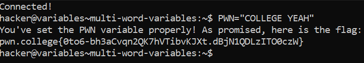

# Multi-Word Variables

## Basic Understanding

If we want to set multiple words or values to a variable, we need to quote them.

`variable_name="val1 val2"`

Ex - `VAR="1337 SAUCE"`

## Challenge Objective

The objective of this challenge is to teach the user about  multi-word variables using "double quotes" in bash.

## Challenge Goals

In this level, we need to set the variable `PWN` to `COLLEGE YEAH`.

I used the following command to set the value of the variable "PWN" as "COLLEGE YEAH"

**Command** - `PWN="COLLEGE YEAH"`

From this, I was able to get the flag.

## Flag

**pwn.college{0to6-bh3aCvqn2QK7hVTibvKJXt.dBjN1QDLzITO0czW}**

