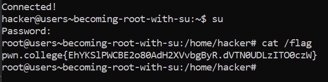

# Becoming Root with su

## Basic Understanding

`su command` - Switch User command - Used to run as the root

su makes sure that the user knows the password.

## Challenge Objectives

The objective of this challenge is to teach user how to run as the root using the su command.

## Challenge Goals

In this challenge, we must run as the root using the `su` command and the password is `hack-the-planet`.

I used the `su` command to run as the root.

Then I entered the Password i.e.  `hack-the-planet`

Then I used the cat command on the flag file and got the flag.

## Flag

**pwn.college{EhYKSlPWCBE2o80AdH2XVvbgByR.dVTN0UDLzITO0czW}**