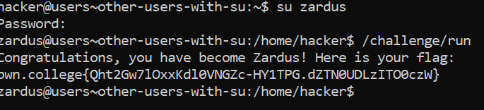

# Other Users With su

## Basic Understanding

We can also give a username as an argument to `su`.

Example - su  username

## Challenge Goals

 In this level, you must switch to the `zardus` user and then run `/challenge/run`. Zardus' password is `dont-hack-me`.

I used the `su` command with the argument `zardus` to set my username to zardus

Then I ran the /challenge/run program and obtained my flag.

## Flag

**pwn.college{Qht2Gw7lOxxKdl0VNGZc-HY1TPG.dZTN0UDLzITO0czW}**