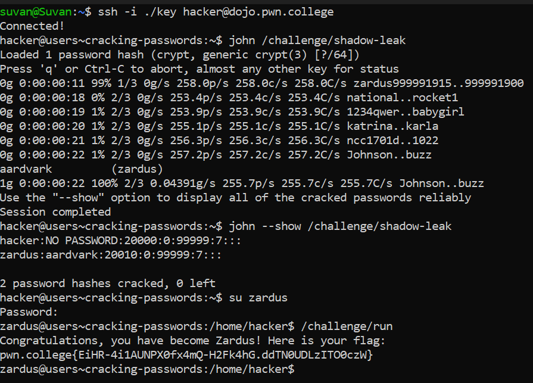

# Cracking Passwords

When you enter a password for su, it compares it against the stored password for that user.
These passwords are stored in `etc/shadow`.

:s, the `first field` of each line is the `username` and the `second` is the `password`. A value of  `* or !` functionally means that password login for the account is disabled.

`John The Ripper tool` - Used to recover passwords

## Challenge Objectives

The objective of this challenge is to teach the user how to crack passwords  using the `john` tool.

## Challenge Goals

This level gives us a leak of `/etc/shadow` (in `/challenge/shadow-leak`). We need to crack it , `su to zardus`, and run `/challenge/run` to get the flag.

I used the `john tool` to leak all the passwords in `/challenge/shadow-leak` program.

**Command** - `john /challenge/shadow-leak`

I see that the user `zardus` has the password `aardvark`.

To confirm this, I again used the `john` tool but this time with the `--show` flag.

**Command** - `john --show /challenge/shadow-leak`

After that I used the su command with username "zardus" to run zardus as my root and entered the password  "aardvark".

After logging in as the root successfully, I ran the `/challenge/run` program and got the flag.

## Flag

**pwn.college{EiHR-4i1AUNPX0fx4mQ-H2Fk4hG.ddTN0UDLzITO0czW}**

