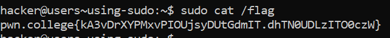

# Using Sudo

## Basic Understading

Root passwords are a pain to maintain, they (or their hashes!) can leak, and they don't lend themselves well to larger environments.

Hence instead of using `su` we now use `sudo`.

`su` - **defaults to launching a shell as a specified user**

`sudo` - **defaults to running a command as root**

Example - sudo grep hacker /etc/shadow

## Challenge Objectives

The objectives of this challenge is to use teach the user  how to use `sudo` and how to use it to gain root access.

## Challenge Goals

In this level, we are given sudo access, and you will use it to read the flag.

Well the screenshot is pretty self-explanatory :)

## Flag

**pwn.college{kA3vDrXYPMxvPIOUjsyDUtGdmIT.dhTN0UDLzITO0czW}**
