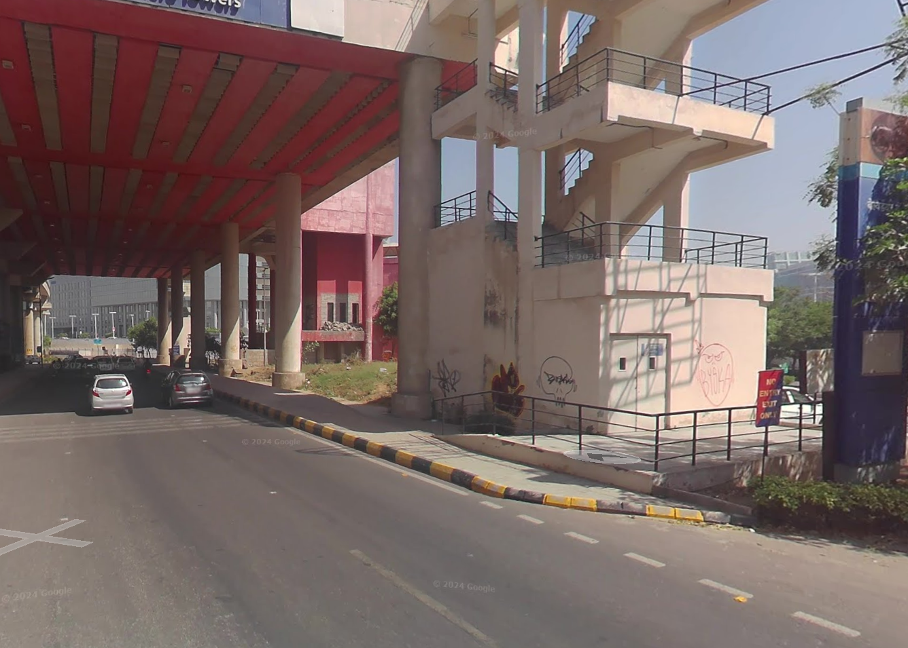

# Beyond a display

## Challenge Details

I took a metro from this location and I saw a shopping complex in the vicinity. I remembered that I saw a multidimensional billboard from a company over there. The same company held a concert on 26th October 2024, and a group performed there. However, I have forgotten what the information really was. Can you help me? 
Flag format: nite{Billboard_Company,Group_Name,Venue_Of_The_Performance}

Image : 

## My Approach

I scanned this image on Google Lens and found the location is Belvedere Towers Metro Station in Gurugram. Now I had to find a billboard that was "multidimensional". Then I found this video "https://www.youtube.com/watch?v=qbhVTUOdobg" that Hyundai had installed India's first 4D billboard in Gurugram. Then I searched for Hyundai concerts and found this website "https://hyundaispotlight.in/" and then I found that there was a "Shankar Ensaan Loy" concert on October 26th at KTPO, Bangalore.

## Flag

`nite{Hyundai,Shankar_Ehsaan_Loy,KTPO}`