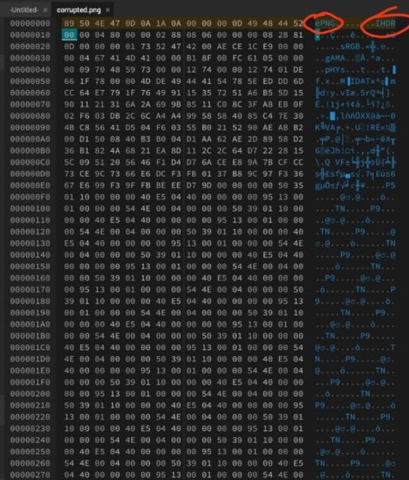
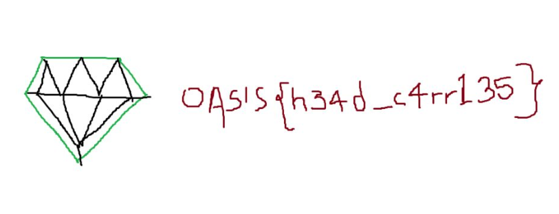

# Heads Up Tails Down

## Question
Finally, you step into the admin control room. Decay has overtaken the space—screens flicker, panels glitch, and virus-riddled code runs rampant across every surface. The system is on the brink of collapse. You sit at the central terminal, but it's unresponsive, frozen by the infection. It's up to you to repair the system and revive the decaying screens. Only then can you regain control.

## Approach

When we opened the corrupted file in a hex-editor, we found out that the file was corrupted because the hexcode was not in the png format. We hence changed the hexcode using a online hexedit tool.

After this we get the proper png image that contains the flag.

## Flag

**OASIS{h34d_c4rr135}**