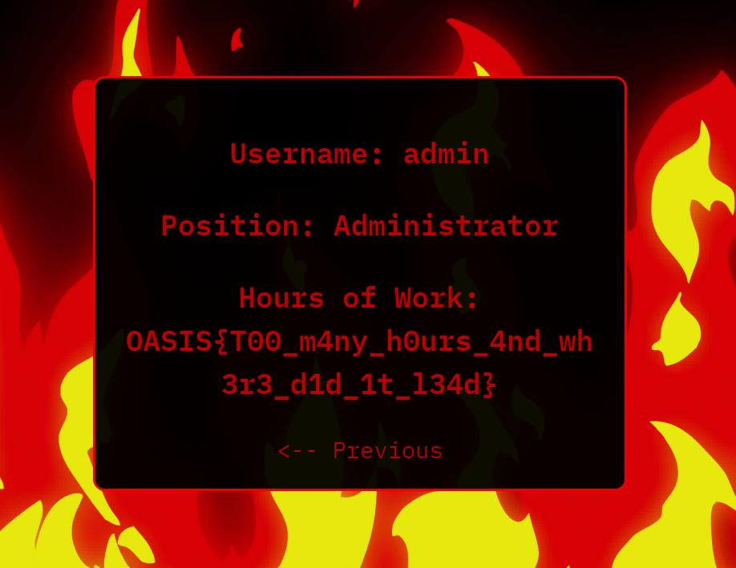

# I Have Been Falling For 30 Minutes

## Question

It hits you! The IOI uses an encrypted communication service to control the virus's every move. Your mission is clear: sever the link between the IOI and the virus to isolate and defeat it. However, you linger too long in one place, and the IOI catches wind of your plan. Fortunately for them, they have a firewall jail just beneath the surface. The ground trembles and splits open, sending you plummeting into the abyss. You land with a resounding THUD, surrounded by towering firewalls. You see a computer in the middle of the cell, and feel like you can use it to your advantage. Can you break free from this digital prison?

Attachment : https://firewall.oasis.cryptonite.live

## Approach

When we opened the website, we saw that there was a button called next that took us to another page and this continued till 5 levels.

So, in the userId parameter of the URL, I put userid=6 and from this we reached a page that contained the flag thereby bypassing the firewall.

## Flag

**OASIS{T00_m4ny_h0urs_4nd_wh3r3_d1d_1t_l34d}**