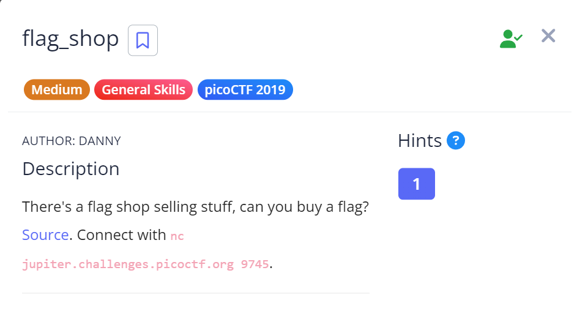

# Flag_Store

## Challenge Details

This challenge was under the General Skills section of PicoCTF but it makes use of an important vulnerability called "Integer Overflow" which is why I planned to keep it here.

## Approach 

So when I used netcat and opened up the challenge, I was given a menu a 3 options. 
1. Check Account Balance
2. Buy Flags
3. Exit

I checked my account balance was initially : 1100 

Then I went to buy flags and the there were 2 options : 
1. Definitely not the flag Flag
2. 1337 flag

Pretty sure the 2nd one would lead me to the actual flag. But I needed 100000 to buy it.

So next I examined the source to find ways to exploit and change my account balance.

And I did find something interesting in the source code:

.png)

Now we see if we choose the first option in the buy flags option, we basically subtract **900 * no.of flags** from the **account_balance**. This is where I can execute the Integer Overflow exploitation.

So basically in C, the `maximum value an integer can have is 2147483647`. When we exceed this value, we move into the negatives.

For example - 2147483647 + 1 = -2147483647

So if I give a large enough value such that if we multiply that with 900 we'll overflow the Integer's limits and move into the negatives and `minus minus = plus`.

.png)

From this I got the flag.

## Flag

`picoCTF{m0n3y_bag5_65d67a74}`

