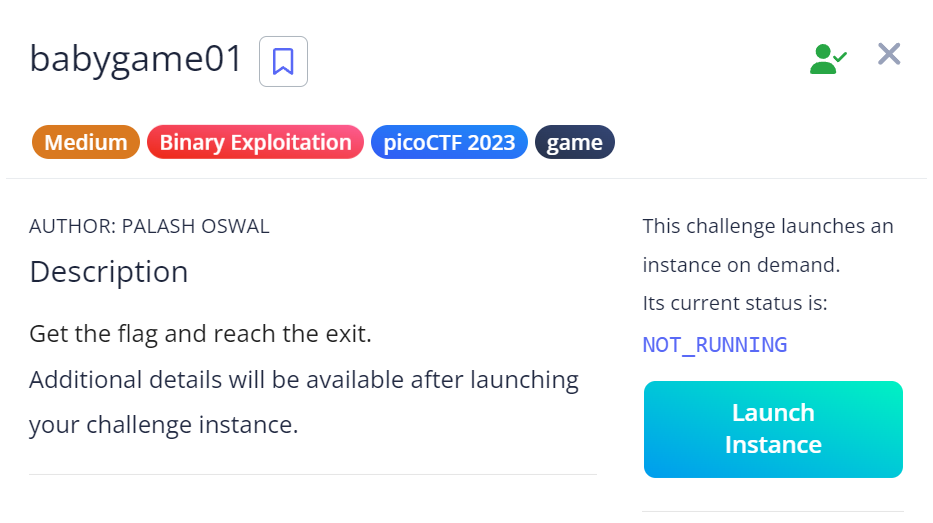

# Babygame 01

## Challenge Description

## Approach

So I connected the game using the netcat command and found a grid which we can traverse using the W,A,S,D keys.

Our target destination was in position 29,89 but when I reached there I just got a message saying "You Win!" but no flag.

So I decided to open up the game file on Ghidra and saw the decompiled C code.

.png)

Then I saw that the "Win" function was called only when a variable was not null.

There were functions called "init-player","init-map","print-map" which basically did the initialisation stuff so I figured they wouldn't be that helpful.

But I saw a function called "move-player" and thought that this could be useful as the essence of this game is to move the player to given position.

.png)

For a better understanding, I renamed the parameters

.png)

I found that there were normal key W,A,S,D which moved the player in the normal expected manner.But then I found that there was a special key called `"P"` that called a function called `"solve round" which redirected the player to the target position`.

Interesting, there was no check for outer bounds in this.

The interesting line here is : `*(undefined *)(*param_1 * 0x5a + param_3 + param_1[1]) = player_tile`

Param_1 is the X- Coordinate and Param_1[1] is the Y-Coordinate.

Param_3 is a base address which I believe is the Origin(0,0).

`So if we move towards the negative direction using param1[1] or the column, we can underflow the memory.`

This is actually an interesting step, as that means when I reach [0,0] of the map I basically reach the `local aa0` of the map.

The `win variable` is at `local aa4`. So there seems to be 4 bytes in the stack and we use a character pointer to access their location.

Therefore, if we move negatively by 4 bytes, we can write into `local aa4` and access the win-variable.

Then by inputting "P" we can reach our target value and finally get the flag.

So what I did is move to position [0,0] manually. Then I moved 4 bytes backwards using "A" four times. And then I inputted p and got the flag

.png)

## My learning

1. How to use Ghidra

2. Analyzing variables and stack, using decompilers

## Flag

`picoCTF{gamer_m0d3_enabled_f4f6ad7d}`