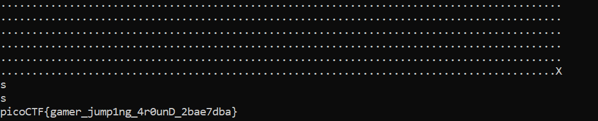

# Babygame 02

## Challenge Description

.png)

## Approach

Like the previous challenge I opened this program in Ghidra again.

.png)

However, unlike the previous level, there was no variable whose value was being compared to give the flag.

However, all the other functions i.e init_player, init_map and move_player looked pretty much the same. Interesting...

I decided to fire up gdb and take a look at all the functions in this program.

Interestingly, I found a function called `win` and maybe that had the flag.

.png)

I went back to Ghidra and found the win function in the given address.

.png)

And this was opening a file called `Flag.txt` which probably contained the flag.

Well if we follow the program execution logic, we're never calling the `win` function by following the steps.

So what we want to do is directly jump to return part of `win` from the main.

Also like the previous level, we know if we move into the negative direction using our column index, we can underflow/overflow the stack.

Looking at the main function, I found out that the stack assignment (assignment of EBP) is happens at address : `0804967e`

.png)

Okay so now comes the hard part.

```
EBP - 4 BYTES

ECX - 4 BYTES

EAX - 4 BYTES

SUB EBP, 0xaa0 [2720 in decimal ]

Then we go to the move player method

SUB 4 - 4 bytes

EDX (EBP - 2709) - 2720 - 2709 = 11 BYTES

EDX - 4 Bytes

EAX - 4 Bytes

EAX - 4 Bytes


Total - 39 bytes

```

That means we need to underflow 39 times.

Now I tried moving to 0,0 and then underflowing it 39 times but it didn't work.

I then moved up "w" once again and repeated and it worked but I'm not exactly sure why.

Then I used lp to move to round to position and s to move to the nop

```
Instructions:
wwwwaaaa
w
aaaaaaaaaaaaaaaaaaaaaaaaaaaaaaaaaaaaaaa
lp
s
```


## Flag

`picoCTF{gamer_jump1ng_4r0unD_2bae7dba}`


