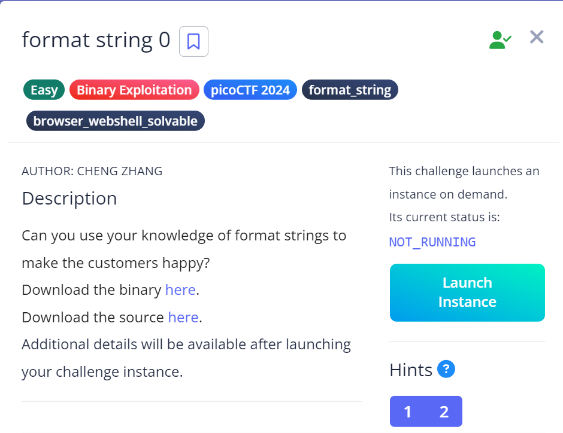
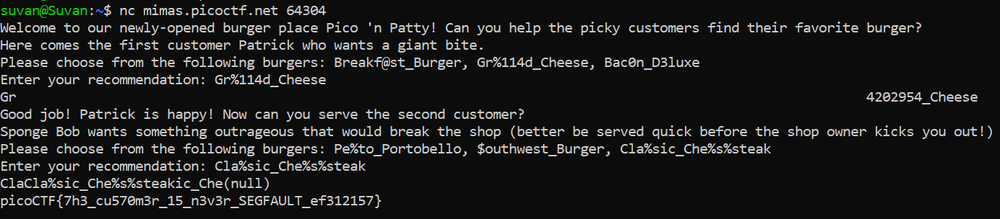

# Format String 0

## Challenge Objectives



## Approach

I opened the challenge using netcat.

This is the message that I saw on running the program

```
Here comes the first customer Patrick who wants a giant bite.
Please choose from the following burgers: Breakf@st_Burger, Gr%114d_Cheese, Bac0n_D3luxe
```

Among these options, only `Gr%114d_Cheese` had a format string i.e. `%114d` and in fact it prints a number with 114 characters, thus justifying `giant bite`

After entering this input, I was asked to choose a burger for Sponge Bob

```
Good job! Patrick is happy! Now can you serve the second customer?
Sponge Bob wants something outrageous that would break the shop (better be served quick before the shop owner kicks you out!)
Please choose from the following burgers: Pe%to_Portobello, $outhwest_Burger, Cla%sic_Che%s%steak
```

Now among these only `Cla%sic_Che%s%steak` makes sense as only this has format specifiers `%s`.

`Also, this causes the memory to crash as when printf processes %s without a corresponding string argument, it can access arbitrary memory or cause the program to crash.`

Thus this justifies `something outrageous that would break the shop`.



## My learning

1. Format specifiers and how to cause a format string error

2. How %s without any arguments can cause an error 

## Flag


