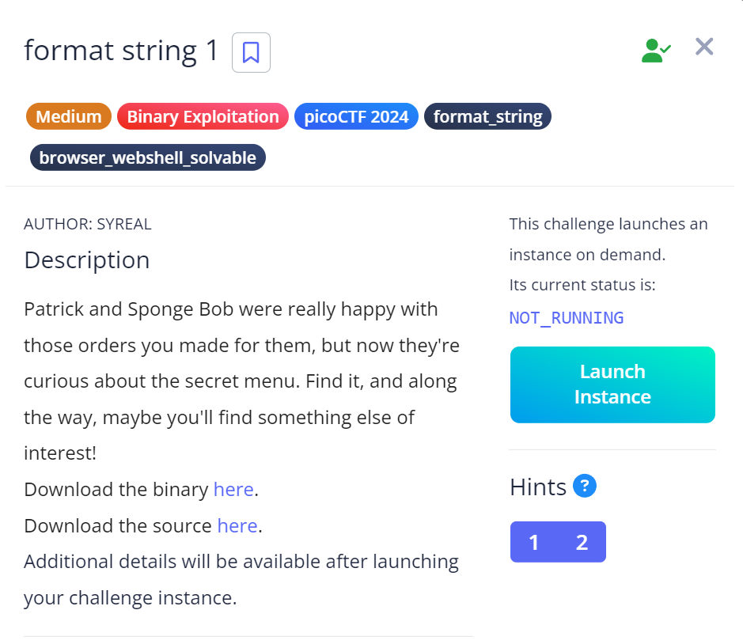
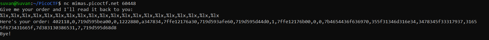

# Format String 1

## Challenge Objectives

## Approach

So this time I connected to the `netcat` and the program asked me to give an order and it would read it back.

We were also given the source code for this and in that I found that there was printf which basically returned the values given by the user.

So I realised that this program is vulnerable to Format String attacks.

To test it, I entered %lx and it indeed returned a random hex value.

So I sent in a large buffer of %lx and got some values.

I sent these hex values into cyberchef and removed the garbage values.

.png)

Now this looks like a flag, however the digits were all scattered.

This is because of the endianness. So I reversed the input to convert the endianess and got the flag.

.png)

## Flag

`picoCTF{4n1m41_57y13_4x4_f14g_e11e8018}`