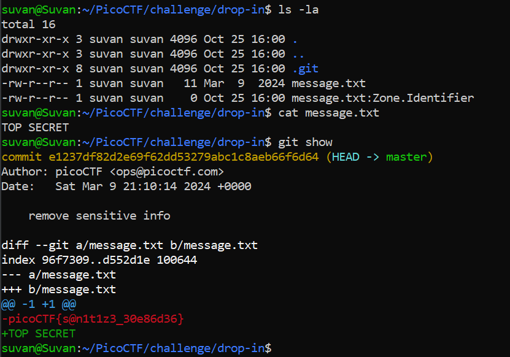

# Commitment Issues

## Description

I accidentally wrote the flag down. Good thing I deleted it!

## Challenge Goals

Okay so after I extracted the zip file and reached the `drop-in` directory, I used the `ls -la` command to  list all the files in the directory with their permissions.

**Command** - `ls -la`

I found a file name `message.txt`.

I used the `cat` command to read the contents of message.txt.

**Command** - `cat message.txt`

It gaev me the output - **TOP SECRET**

I also noticed that there was a git push before the message.txt file was changed to "TOP SECRET".

To see the differences from the previous commit, I used the `git show` command.

**Command** - `git show`

From this, I see that the previous input (which is in red) was the flag and new input (in green) is "TOP SECRET"

## Flag

`picoCTF{s@n1t1z3_30e86d36}`

