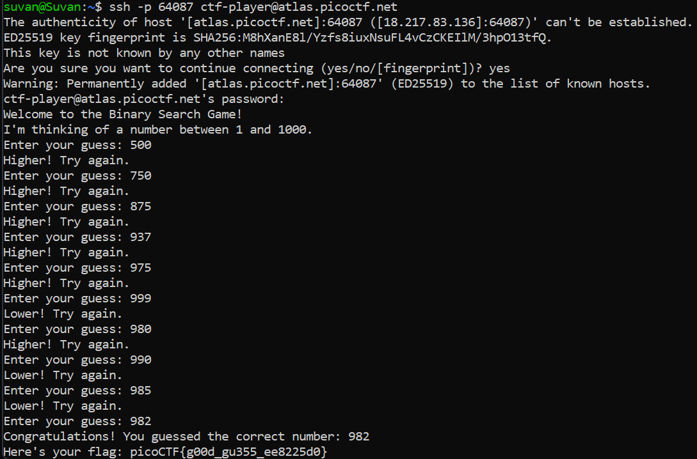

# Endianness

## Basic Understanding

Endianness is used to describe the order of bytes in hexadecimal data.

Endianness contains two ways in which multi-byte data are represented in the memory. :-

- `Little Endian` - Most significant byte is first

- `Big Endian` - Least significant byte is first

It is important to know the endianness of a value. If we don't know the endianness  of a value, we can't correctly read or write it.

According on Internet standards, all the field of the network should be in big endian.

**Reference** - https://www.youtube.com/watch?v=LxvFb63OOs8

## Challenge Goals

So after I logged in to the titan.picoctf.net server using the netcat(nc),  I got the following message:

"You need to find both the little endian and big endian representations of a word.

If you get both correct, you will receive the flag.

Word: **viurd**"

Okay so the first thing we needed to find was the **Little Endian**  representation of the word "viurd".

So the first thing I did way convert the given word into Hexadecimal  format. Using an online ASCII to Hexadecimal converter.

In Little Endian we need to  reverse the order of the bytes and remove the spaces.

Little Endian - `6472756976`

In Big Endian, we don't need to make any changes, we just need to remove the spaces.

Big Endian - `7669757264`

From this, I got the flag.

## Flag

`picoCTF{3ndi4n_sw4p_su33ess_cfe38ef0}`

