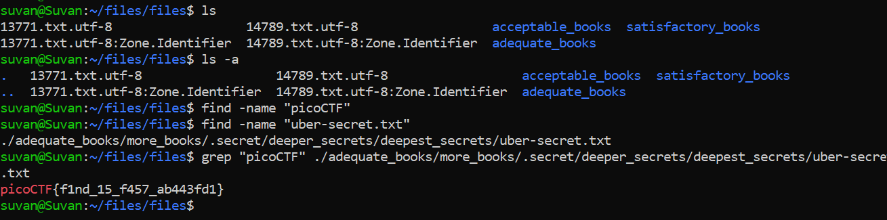

# First Find

## Challenge Objective

The objective of this challeneg is to use the **find** command to find a particular file in the directory.

## Challenge Goals

In this challenge, we need to find for the file  named `"uber-seceret.txt"` after unzipping the folder.

I used the following command to find the required file:

**Command** - `find  . -name "uber-seceret.txt"`

Then I found the location of the uber-secret.txt file.

Now I know that every flag starts with **"picoCTF** and hence I used the grep command to find all patterns containing  the string "picoCTF" in the file:

**Command** - `grep "picoCTF" /the-file-path`

From this, I got the flag.

## Flag

`picoCTF{f1nd_15_f457_ab443fd1}`
