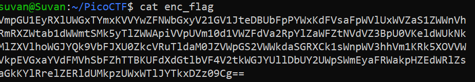
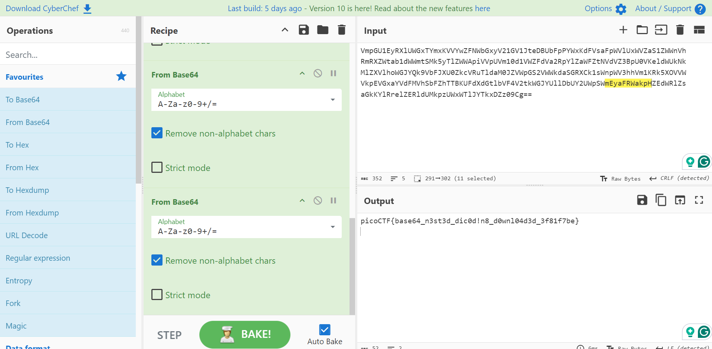
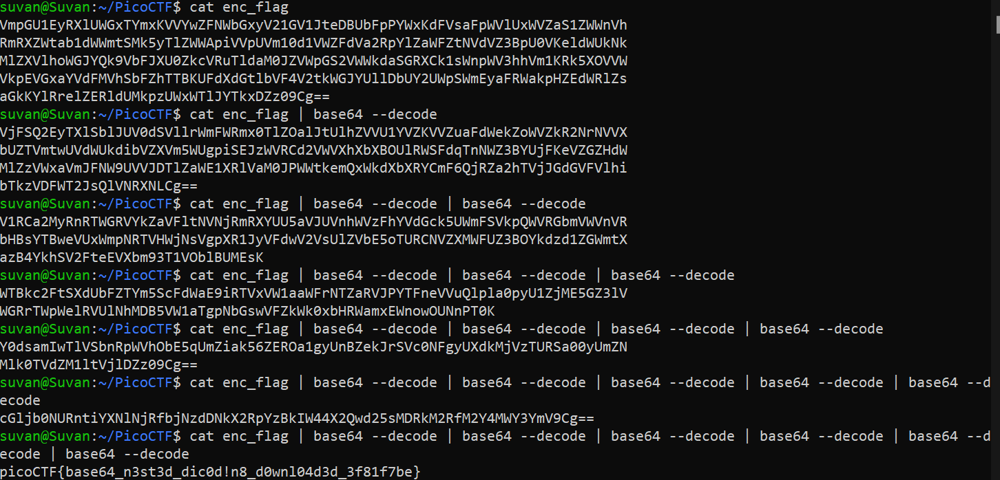

# Repetitions 

## Challenge Goals

So in this level, we need to download a file called make sense of it.

When I used the **cat** command to display the contents of the file, I found data which was encrypted.

I deduced that it is Base64  encoded data using the following observations :-

1. `The length of a Base64-encoded string is always a multiple of 4`
2. `Only these characters are used by the encryption: “A” to “Z”, “a” to “z”, “0” to “9”, “+” and “/”`
3. `The end of a string can be padded up to two times using the “=”-character`

I observed that this encrypted data  was a multiple of 4 in length(it has 344 characters), and it only contained the characters `A` to `z` and is padded in the end with two  `=` characters.

Now there are two approaches that I found to be useful to solve this challenge. One is by using an Online Base64 decoder or the 2nd one is to use the base64 decoder on the Linux CLI.

Also the hint of this level specified that we need to use multiple decoding, which made me think that we need to use the Base64 decoding more than once till we get the desired output.

## Approach 1 - Online Decoder

I used the online Base64 decoder to decode the data. Here is the link to the tool that https://gchq.github.io/CyberChef/.

After repeatedly decoding the outputs 6 times. I got the flag.

## Approach 2 -  Linux CLI

I used the Base64 decoder function on the catted outputs until I got the desired flag.

## Flag

**picoCTF{base64_n3st3d_dic0d!n8_d0wnl04d3d_3f81f7be}**

