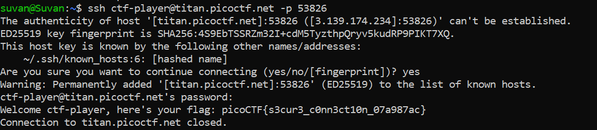

# Super SSH

## Basic Understanding
**Shell** - An interface that accepts human readable commands and translates it into something the kernel can understand and execute

**Secure Shell (SSH)** -  A network protocol that allows us to connect to a host computer from a remote network. It uses public key cryptography/assymetric cryptography to achieve this goal.

**Port (P)** - Connection that services use to exchange information.

Examples of some common ports are -
- Port 80 for web pages (HTTP)
- Port 443 for web pages (HTTPS)
- Port 25 for emails
- Port 22 for SSH
- Port 21 for FTP (File Transfer Protocol)

## Challenge Goals

In this challenge, we need to ssh to `titan.picoctf.net` with the username `ctf-player`.
and the port we have used to connect is `53826`. 

The password we require to connect is : `84b12bae`

I connected to the server  using the following command:

`ssh  ctf-player@titan.picoctf.net -p 53826`

After successfully connecting to the server, we get the flag.

## Flag

`picoCTF{s3cur3_c0nn3ct10n_07a987ac}`
