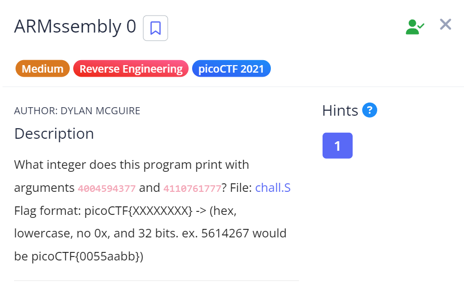

# ARMssembly 0

## Challenge Details

## Approach

**Assembly Code** - [ARMssembly](./Resources&SourceCodes/ARMssembly0.asm)

When I opened the file, I found a code written in ARM assembly language.

After spending some time researching and learning about ARM, I was somewhat able to decipher what's going on.

So here I'll explain what I understood :-

1. **Main Function**

    x29 - Frame Pointer

    str w0, [x29, 44]           // Save argc (number of arguments) at [x29 + 44] 

    str x1, [x29, 32]           // Save argv (array of argument pointers) at [x29 + 32]

    ldr x0, [x29, 32]           // Load the address of argv into x0

    add x0, x0, 8               // Move to argv[1] (first argument) (incrementing the address by 8 bytes)

    ldr x0, [x0]                // Load the string at argv[1] into x0

    bl atoi                     // Convert the string to an integer using atoi

    mov w19, w0                 // Save the first integer (argv[1]) in w19 (w19 is like a temp register)

    So in this part we've basically taken our first argument and converted it into an integer and the next steps also do the same for the 2nd argument.

    mov w0, w19                 // Load the first integer (argv[1]) into w0

    bl func1                    // Call func1 to compare the two integers

    mov w1, w0                  // Store the result of func1 in w1

    Then we call the func1 function and store the obtained result in register w1.

2. **Func1**

    In func1, we first allocate space on the stack for 2 integers. Stack grows downward in memory so we use the SUB (subtract function) to allocate space on the stack.

    sub sp, sp, #16             // Create space on the stack for two integers

    str w0, [sp, 12]            // Store the first argument (w0) at address [sp + 12](offset 12)

    str w1, [sp, 8]             // Store the second argument (w1) at [sp + 8]

    ldr w1, [sp, 12]            // Load the first integer back into w1

    ldr w0, [sp, 8]             // Load the second integer back into w0

    cmp w1, w0                  // Compare w1 and w0
    
    bls .L2                     // If w1 <= w0, jump to label L2

    ldr w0, [sp, 12]            // Otherwise, load w1 into w0 (return the larger value)

    b .L3                       // Skip to the end

    So this function first stores the 2 arguments given from the main function into memory using STR.
    Then we load them back again and compare them.

    Finally after the comparision is done, they are sent to their respective labels and then the greater value is printed using printf.

So essentially, we need to convert the greater number into hexadecimal and that's our flag.

Decimal:  4110761777 
Hexadecimal: F5053F31

## Flag

`picoCTF{F5053F31}`

## Resources

https://azeria-labs.com/writing-arm-assembly-part-1/

https://www.youtube.com/playlist?list=PLn_It163He32Ujm-l_czgEBhbJjOUgFhg

