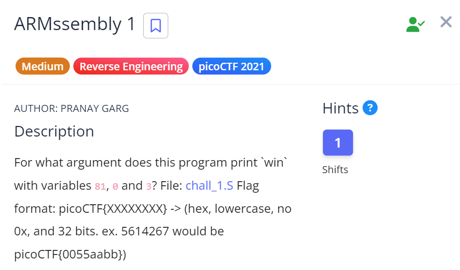

# ARMssembly 1

## Challenge Details

## Approach

**Assembly Code** - [ARMssembly1](./Resources&SourceCodes/ARMssembly1.asm) 

1. **Main Function**

        stp     x29, x30, [sp, -48]!        //Allocating 48 bytes of space in the stack. x29 which is frame register is stored at sp and x30 which is link register is stored at sp+8

        add     x29, sp, 0

        str     w0, [x29, 28]           // Storing argc at address [x29+28]

        str     x1, [x29, 16]           // Storing argv(array of argument pointers) at address [x29+28]

        ldr     x0, [x29, 16]          // Loading the address of argv array into register x0

        add     x0, x0, 8              // Incrementing x0 with 8 bytes to move to argv[0] (Our first argument)

        ldr     x0, [x0]                //Loading argument into register x0

        bl      atoi                    // Converting from string to integer

        str     w0, [x29, 44]           // Storing the integer argument at w0 into the stack memory at address[x29+44]

        ldr     w0, [x29, 44]           //Loading the argument which was stored in the previous step into register w0

        bl      func                    // Calling the func function

        cmp     w0, 0                   // Comparing the value returned by func with 0

        bne     .L4                     //If not equal, then we branch to label L4 and from there we branch to label LC1 which prints "You Lose"

        adrp    x0, .LC0                // If they are equal, it b

2. **Func**

        sub     sp, sp, #32             // Allocate 32 bytes of space on the stack

        str     w0, [sp, 12]            // Store the argument into the stack at address[sp+12]

        mov     w0, 81                 // move the integer value 81 into register w0

        str     w0, [sp, 16]           // Store the value 81 into memory at address[sp+16]

        str     wzr, [sp, 20]          // Store the zero register(wzr) into memory at address[sp+20]

        mov     w0, 3                  // move the value 3 into w0 register

        str     w0, [sp, 24]           // Store the value 3 into memory at address[sp+24]

        ldr     w0, [sp, 20]           // Loads the value stored at address[sp+20] i.e 0 into w0 register

        ldr     w1, [sp, 16]          // Loads the value stored at address[sp+16] i.e 81 into w0 register

        lsl     w0, w1, w0            // Left shifting w1(81) by w0(0) times and stroing it in w0.       Nothing changes because no. of shifts =0

        str     w0, [sp, 28]         // Storing the value of w0 register at memory address[sp+28]

        ldr     w1, [sp, 28]        // Loading the value at address[sp+28] i.e 81 into w1 register

        ldr     w0, [sp, 24]        //Loading the value at address[sp+24] i.e 3 into w0 register

        sdiv    w0, w1, w0         // Dividing w1/w0 and storing result in w0. 81/3 = 27 and hence,w0=27

        str     w0, [sp, 28]        // Storing the value of w0 (27) in memory address[sp+28]

        ldr     w1, [sp, 28]       //Loading the value of address[sp+28] into w1 register

        ldr     w0, [sp, 12]       // Loading the value of address[sp+12] (the argument) into w0 register

        sub     w0, w1, w0         // w1(27) - w0(argument) and stores the result in w0

        str     w0, [sp, 28]       // The value of w0 is stored in memory address[sp+28]

        ldr     w0, [sp, 28]    // The value at address[sp+28] is loaded into register w0

        add     sp, sp, 32      // The 32 bits of space allocated for the stack is added back to empty it

        ret                     //Returns back to the caller function

So essentially, this function basically subtracts the argument from the value 27 and if it is equal to 0, then we win.

Therefore, the value that needs to be passed as argument = 27

27 in hexadecimal = 1B

## Flag
`picoCTF{0000001B}`