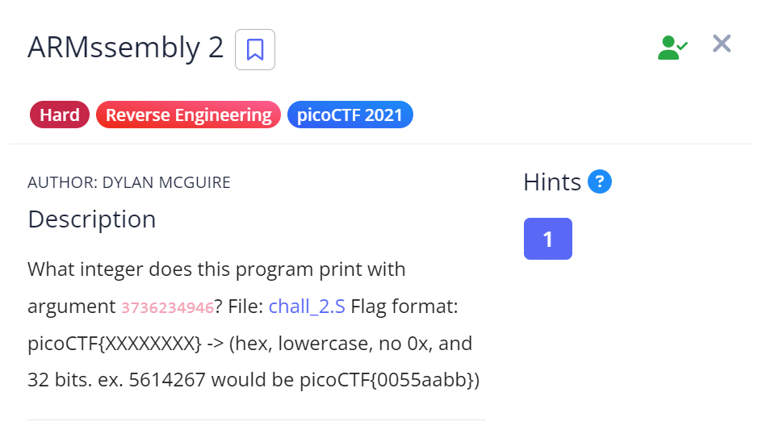

# ARMssembly 2

## Challenge Description

## Approach

**Assembly Code** - [ARMssembly2](./Resources&SourceCodes/ARMssembly2.asm)

1. **Main Function**

        stp     x29, x30, [sp, -48]!           //Allocating 48 bytes of space in the stack. x29 which is frame register is stored at sp and x30 which is link register is stored at sp+8

        add     x29, sp, 0      

        str     w0, [x29, 28]                 // Storing argc at address[x29+28]

        str     x1, [x29, 16]                // Storing argv at address[x29+16]

        ldr     x0, [x29, 16]                // Loading argv from memory into register x0

        add     x0, x0, 8                   // Adding 8 bytes to access argv[0] (our first argument) and storing the result in x0

        ldr     x0, [x0]                   // Loading x0 (dereferencing pointer to argv[0])

        bl      atoi                       // String to Integer conversion

        bl      func1                      // Calling func1

        str     w0, [x29, 44]

        adrp    x0, .LC0

        add     x0, x0, :lo12:.LC0

        ldr     w1, [x29, 44]

        bl      printf

        nop

        ldp     x29, x30, [sp], 48

        ret

2. **func1 and labels**

func1:
        sub     sp, sp, #32             // Allocating 32 bytes of space in stack

        str     w0, [sp, 12]            // Storing our first argument which is in w0 into address[sp+12]

        str     wzr, [sp, 24]           // Storing zero register in address[sp+24]

        str     wzr, [sp, 28]           // Storing zero register in address[sp+28]

        b       .L2                     // Branching to L2
.L3:
        ldr     w0, [sp, 24]            // Loading the value at address[sp+24] into register w0

        add     w0, w0, 3              // Adding 3 to the value at w0

        str     w0, [sp, 24]           // Storing the result back into stack at the same address

        ldr     w0, [sp, 28]           // Loading the value at address[sp+28] into register w0 

        add     w0, w0, 1             // Adding 1 to the value at w0

        str     w0, [sp, 28]          // Storing the result back into stack at the same address
.L2:
        ldr     w1, [sp, 28]          // Loading the value at address[sp+28] into register w1

        ldr     w0, [sp, 12]          // Loading the value at address[sp+12] (argument) into register w0

        cmp     w1, w0               // Comparing w1 and w0

        bcc     .L3                 // If carry is clear (w1 < w0)  branch to .L3

        ldr     w0, [sp, 24]        // Else load the value at [sp+24] into register w0

        add     sp, sp, 32          // Deallocate the space on the stack

        ret                         // Return to caller function
   

So basically what we're doing here is we're comparing if the value at w1 or address[sp+28] is greater than or equal to the argument.

If they are not equal, then we increment the value at address[sp+24] by 3 and the value at address[sp+28] by 1.

Finally, when w1 = w0, we're returning the value at [sp+24] = Argument Value * 3

Decimal Value = 3736234946 * 3 = 11,20,87,04,838
Hexadecimal value = 29C174346

## Flag

`picoCTF{29C174346}