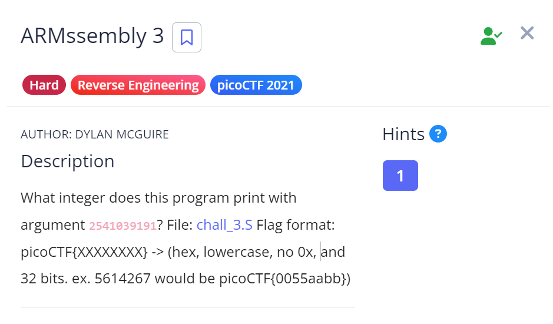

# ARMssembly 3

## Challenge Details

## Approach

**Assembly Code** - [ARMssembly3](./Resources&SourceCodes/ARMssembly3.asm)

1. **Main Function**

    Same as the previous levels, we're again calling func1 and passing 1 argument to it.

2. **Func1**

        stp     x29, x30, [sp, -48]!           // Allocating 48 bytes of space in the stack same way as we have done in the previous levels

        add     x29, sp, 0                     

        str     w0, [x29, 28]                   // Storing our argument in address[x29+28]

        str     wzr, [x29, 44]                 // Storing zero in address[x29+44]

        b       .L2                            // Branching to label L2

3. **.L2**

        .L2:                                  

        ldr     w0, [x29, 28]                  // Loading value at address[x29+28] in w0

        cmp     w0, 0                          // Comparing the value at w0 with 0

        bne     .L4                            // If they are not equal, we branch to label L4

        ldr     w0, [x29, 44]

        ldp     x29, x30, [sp], 48

        ret

4. **.L4**

        .L4:

        ldr     w0, [x29, 28]                  // Loading the value at address[x29+28] into w0          

        and     w0, w0, 1                      // Doing AND operation on w0 with 1

        cmp     w0, 0                          // Basically here we're checking if w0 is odd

        beq     .L3                            // If it is even, we're branching it to .L3

        ldr     w0, [x29, 44]                  // If value is odd, we're loading the value at x0 into address[x29+44]

        bl      func2                          // Branching to func2

        str     w0, [x29, 44]

5. **.L3**

        ldr     w0, [x29, 28]                   // Load the value at address[x29+28] into w0

        lsr     w0, w0, 1                       // Right shift one time

        str     w0, [x29, 28]                   // Store the value into address[x29+28]

6. **Func2**

        func2:
        sub     sp, sp, #16                     // Allocating 16 bytes of space in the stack

        str     w0, [sp, 12]                    // Storing the value at w0 at address[sp+12]

        ldr     w0, [sp, 12]                    // Loading the value at address[sp+12] into w0

        add     w0, w0, 3                       // Adding 3 to w0 and storing the result in w0 itself

        add     sp, sp, 16                      // Deallocating the previously allocated space on stack

        ret

So basically what we're doing is, we're checking whether the value at address[x29+28] which initially is our argument is even or odd.

If it is even (i.e last digit in binary = 0), then we're doing a logical right shift.
If it is odd, then we add 3 to value at address[x29+44] which was initially set to 0 and then right shift the value at address[x29+28].

We keep repeating this till the value at address[x29+28] is 0.

So, in the end we need to check how many 1's are there in the binary and multiply 3 to get the required decimal value.

Argument - 2541039191
Argument in binary - 10010111011101010010111001010111
No of one's = 19
Required Decimal value - 57
Required hexadecimal value - 00000039

## Flag

`picoCTF{00000039}`

